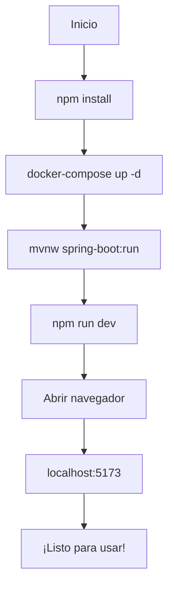

# 🚀 Instrucciones de Inicio - Sistema de Calificaciones

## ⚡ Inicio Rápido (Opción Recomendada)

### Windows PowerShell
```powershell
# Paso 1: Instalar dependencias
npm install

# Paso 2: Ejecutar script automático
.\iniciar.ps1

# Paso 3: Seleccionar opción 3 (Backend + Frontend)
```

---

## 📋 Inicio Manual (Opción Alternativa)

### Requisitos Previos
- ✅ Node.js 18+ instalado
- ✅ Java 17+ instalado
- ✅ Maven instalado (o usar el wrapper incluido)
- ✅ Docker Desktop instalado y corriendo

### Paso a Paso

#### 1️⃣ Preparar Frontend
```bash
# Instalar dependencias npm
npm install

# Verificar que se crearon node_modules
```

#### 2️⃣ Iniciar Base de Datos
```bash
# Ir a carpeta backend
cd backend

# Iniciar PostgreSQL con Docker
docker-compose up -d

# Verificar que esté corriendo
docker ps

# Debe aparecer: calificaciones-postgres

# Volver a raíz
cd ..
```

#### 3️⃣ Iniciar Backend (Terminal 1)
```bash
# Ir a carpeta backend
cd backend

# Windows
mvnw.cmd spring-boot:run

# Linux/Mac
./mvnw spring-boot:run

# Esperar mensaje: "Started CalificacionesApplication"
# Backend estará en http://localhost:8080
```

#### 4️⃣ Iniciar Frontend (Terminal 2)
```bash
# En la raíz del proyecto (otra terminal)
npm run dev

# Esperar mensaje: "Local: http://localhost:5173"
# Frontend abrirá automáticamente en el navegador
```

---

## 🌐 URLs de Acceso

Una vez iniciado todo:

| Servicio | URL | Descripción |
|----------|-----|-------------|
| **Frontend** | http://localhost:5173 | Aplicación React |
| **Backend API** | http://localhost:8080/api | REST API |
| **Base de Datos** | localhost:5432 | PostgreSQL |

### Prueba de Conectividad

**Backend API:**
```bash
# En PowerShell o terminal
curl http://localhost:8080/api/alumnos
# Debe retornar: [] o lista de alumnos
```

**Frontend:**
Abre http://localhost:5173 en el navegador

---

## 🎯 Primera Vez (Setup Inicial)

Si es la primera vez que ejecutas el proyecto:

### 1. Verificar instalaciones
```bash
# Node.js
node --version
# Debe mostrar: v18.x o superior

# Java
java -version
# Debe mostrar: version "17" o superior

# Docker
docker --version
# Debe mostrar versión instalada
```

### 2. Instalar dependencias
```bash
npm install
```

### 3. Configurar variables de entorno
El archivo `.env` ya está configurado:
```env
VITE_API_URL=http://localhost:8080/api
```

Si tu backend usa otro puerto, modifícalo.

---

## 🔄 Reinicios y Detener

### Detener Servicios

**Frontend:**
- Presiona `Ctrl + C` en la terminal del frontend

**Backend:**
- Presiona `Ctrl + C` en la terminal del backend

**Base de Datos:**
```bash
cd backend
docker-compose down
```

### Reiniciar Servicios

Sigue los pasos de inicio manual nuevamente, o ejecuta:
```powershell
.\iniciar.ps1
```

---

## 🐛 Resolución de Problemas Comunes

### Problema: "Port 5173 already in use"

**Solución Windows:**
```powershell
Get-Process -Id (Get-NetTCPConnection -LocalPort 5173).OwningProcess | Stop-Process
```

**Solución alternativa:**
Cambiar puerto en `vite.config.ts`:
```typescript
server: {
  port: 5174, // Cambiar puerto
}
```

### Problema: "Port 8080 already in use"

**Solución Windows:**
```powershell
Get-Process -Id (Get-NetTCPConnection -LocalPort 8080).OwningProcess | Stop-Process
```

**Verificar qué usa el puerto:**
```powershell
Get-Process -Id (Get-NetTCPConnection -LocalPort 8080).OwningProcess
```

### Problema: "Cannot connect to backend"

**Verificaciones:**
1. ✅ Backend está corriendo? → Ver terminal del backend
2. ✅ URL correcta en `.env`? → `VITE_API_URL=http://localhost:8080/api`
3. ✅ CORS habilitado? → Sí, está en los controllers
4. ✅ Firewall bloqueando? → Verificar firewall de Windows

### Problema: "Database connection failed"

**Verificaciones:**
1. ✅ Docker está corriendo? → Abrir Docker Desktop
2. ✅ PostgreSQL iniciado? → `docker ps` debe mostrar calificaciones-postgres
3. ✅ Puerto 5432 libre? → Cerrar otras instancias de PostgreSQL

**Reiniciar base de datos:**
```bash
cd backend
docker-compose down
docker-compose up -d
```

### Problema: "npm install fails"

**Solución:**
```bash
# Limpiar caché
rm -rf node_modules package-lock.json

# Limpiar caché de npm
npm cache clean --force

# Reinstalar
npm install
```

### Problema: "Maven/mvnw not found"

**Windows:**
```bash
# Usar el wrapper de Maven incluido
cd backend
mvnw.cmd spring-boot:run
```

**Linux/Mac:**
```bash
# Dar permisos de ejecución
chmod +x mvnw
./mvnw spring-boot:run
```

---

## 📊 Verificación de Estado

### Checklist de Servicios Corriendo

- [ ] Docker Desktop abierto
- [ ] PostgreSQL corriendo (`docker ps`)
- [ ] Backend corriendo (ver terminal, puerto 8080)
- [ ] Frontend corriendo (ver terminal, puerto 5173)
- [ ] Navegador abierto en http://localhost:5173

### Comandos de Verificación

```bash
# Ver procesos Docker
docker ps

# Ver logs de PostgreSQL
docker logs calificaciones-postgres

# Verificar API backend
curl http://localhost:8080/api/alumnos

# Ver puertos en uso (Windows)
netstat -ano | findstr ":5173"
netstat -ano | findstr ":8080"
netstat -ano | findstr ":5432"
```

---

## 🎬 Flujo de Inicio Completo



### Tiempo estimado de inicio
- Primera vez: ~5 minutos
- Siguientes veces: ~2 minutos

---

## 📝 Notas Importantes

### Sobre el Backend
- El backend debe iniciarse **antes** que el frontend
- Espera a ver "Started CalificacionesApplication"
- El puerto 8080 debe estar libre

### Sobre el Frontend
- Se abrirá automáticamente en el navegador
- Hot Module Replacement está activo
- Los cambios se reflejan al instante

### Sobre la Base de Datos
- Solo necesita iniciarse una vez
- Se mantiene corriendo en segundo plano
- Usa `docker-compose down` para detener

---

## 🚀 Comandos Más Usados

### Durante Desarrollo

```bash
# Ver logs del backend
cd backend
./mvnw spring-boot:run

# Ver logs de la DB
docker logs -f calificaciones-postgres

# Compilar backend
./mvnw clean package

# Build del frontend
npm run build

# Linter
npm run lint
```

---

## 📞 Ayuda Adicional

Si tienes problemas:

1. **Revisar documentación:**
   - [README-FRONTEND.md](./README-FRONTEND.md) - Detalles del frontend
   - [GUIA-PRUEBAS.md](./GUIA-PRUEBAS.md) - Casos de prueba
   - [PROYECTO-COMPLETO.md](./PROYECTO-COMPLETO.md) - Vista general

2. **Verificar logs:**
   - Terminal del backend
   - Terminal del frontend
   - Consola del navegador (F12)
   - Docker logs

3. **Reinstalar desde cero:**
   ```bash
   # Frontend
   rm -rf node_modules package-lock.json
   npm install
   
   # Backend
   cd backend
   ./mvnw clean
   docker-compose down -v
   docker-compose up -d
   ```

---

## ✅ Todo Listo!

Si has seguido estos pasos, deberías tener:
- ✅ Frontend corriendo en http://localhost:5173
- ✅ Backend corriendo en http://localhost:8080
- ✅ Base de datos PostgreSQL activa
- ✅ Sistema completo funcional

**¡Ahora puedes usar la aplicación! 🎉**

---

**Última actualización:** Enero 2026
